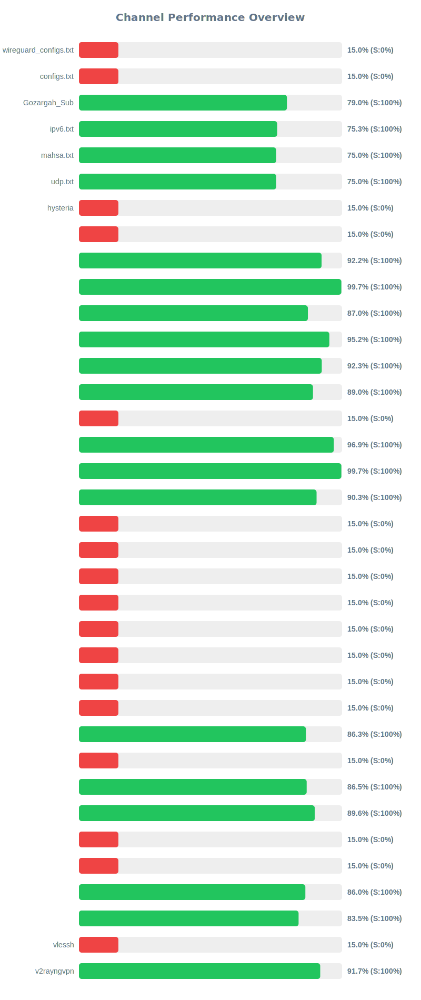

[](https://github.com/Ryanprg/AIDreamers-Conf/stargazers)
[](https://github.com/Ryanprg/AIDreamers-Conf/network/members)
[](https://github.com/4n0nymou3/multi-proxy-config-fetcher/issues)
[](https://github.com/Ryanprg/AIDreamers-Conf/blob/main/LICENSE)
[](https://github.com/Ryanprg/AIDreamers-Conf/commits)

# Multi Proxy Config Fetcher

[**🇺🇸English**](README.md) | [**فارسی**](README_FA.md)

This project automatically fetches and updates various proxy configurations from public Telegram channels, SSCONF links and other URLs containing configuration data. It supports multiple proxy protocols including WireGuard, Hysteria2, VLESS, VMess, Shadowsocks, TUIC, and Trojan.

## Quick Access to Configs

You can directly access the latest configurations through this URL:
```
https://raw.githubusercontent.com/Ryanprg/AIDreamers-Conf/refs/heads/main/configs/proxy_configs.txt
```
This project features advanced capabilities for proxy configuration management. The retrieved configurations are automatically converted to Sing-box format and stored in a separate JSON file. For each server, its geographical location is identified using the get location method, and the corresponding flag emoji and country name are automatically added to its tag. These features make proxy management and usage significantly more user-friendly and efficient.

Sing-box subscription link:
```
https://raw.githubusercontent.com/Ryanprg/AIDreamers-Conf/refs/heads/main/configs/singbox_configs.json
```

## Channel and URL Performance

Below is the real-time performance statistics of the configured sources (Telegram channels and other URLs). This chart is automatically updated every hour.

### Quick Overview
<div align="center">
  <a href="assets/channel_stats_chart.svg">
    
  </a>
</div>


## Features

- Supports multiple proxy protocols:
  - WireGuard
  - Hysteria2
  - VLESS
  - VMess
  - Shadowsocks (SS)
  - Trojan
  - TUIC
- Fetches configs from:
  - Public Telegram channels
  - SSCONF format links
  - URLs hosting configuration files
- Smart handling of base64-encoded configs (preserves original format)
- Protocol-specific validation and verification
- Automatically updates configs every hour
- Validates config age (excludes configs older than 90 days)
- Removes duplicates
- Real-time source performance monitoring
- Automatic source health management
- Dynamic protocol distribution balancing

If you fork this repository, you need to manually enable GitHub Actions:
1. Go to `Settings > Actions` in your forked repository.
2. Select **Allow all actions and reusable workflows**.
3. Save the settings.

## Project Structure

```
├── src/
│   ├── config.py              # Project configuration
│   ├── config_validator.py    # Config validation and verification
│   └── fetch_configs.py       # Main fetcher implementation
├── configs/
│   ├── proxy_configs.txt      # Output configs
│   └── channel_stats.json     # Source performance stats
└── .github/
    └── workflows/
        └── update-configs.yml # GitHub Actions workflow
```

## Source Statistics

The project tracks comprehensive performance metrics of each source in `configs/channel_stats.json`:
- Overall performance score (0-100%)
- Success rate in fetching configurations
- Valid vs total configs ratio
- Unique config contribution
- Response time and reliability
- Source health status


## About the Developer

Developed by **4n0nymou3**.  
